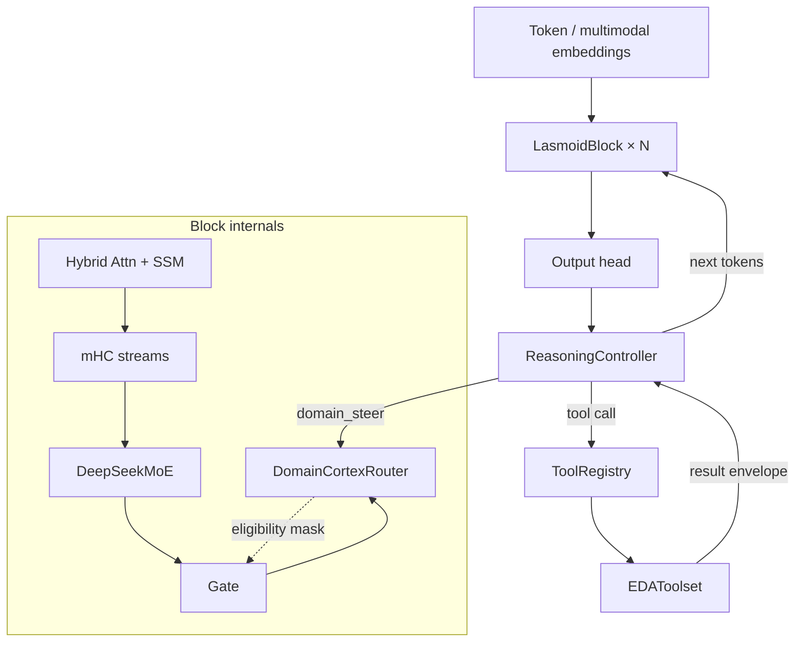

# Design Document: Lasmoid Cortex

## Overview

Lasmoid Cortex turns Lasmoid into a brain-like, sparsely-activated scientific reasoner. It adds three layers on top of the existing hybrid transformer-SSM / DeepSeekMoE core, following **Candidate B** from `architecture_selection.md`:

1. **Sparse Domain Cortex** *(implemented)* — partitions MoE experts into scientific *cortical columns* and fires only the top-k relevant columns per token.
2. **Tool / EDA Sidecar** *(designed)* — a typed tool registry + EDA primitives so the model derives information from raw data.
3. **Reasoning Controller** *(designed)* — a propose→verify→refine loop that orchestrates tools and self-verification for long-running tasks.

Everything is config-gated and defaults off; with all flags off the model is identical to the current baseline (90/90 existing+new tests pass).

### Provenance (reference repos under NEXUS)
- Cortical-column sparse routing ← DeepSeekMoE group routing (`moe.py`) generalised with a dedicated domain router.
- Cross-domain doubly-stochastic mixing ← `mHC-manifold-constrained-hyper-connections` `sinkhorn_log`.
- Multi-track iterative refinement (future Candidate C) ← `alphafold3` Evoformer/Pairformer (OuterProductMean, TriangleMultiplication).
- Episodic clustering + attention-importance eviction ← `ml-epicache` (`ClusterManager`, `KVScore`).
- Propose→verify→refine + log-prob/heuristic scoring ← `reasoning-from-scratch` (`self_refinement_loop`, `avg_logprob_answer`, `heuristic_score`).
- Heavy-tail / MIMO / RoPE-state SSM ← `mamba` Mamba-3 (already integrated in `ssm.py`).

## Architecture



## Components and Interfaces

### Component 1: DomainCortexRouter  *(implemented — `inference/cortex.py`)*

```python
class DomainCortexRouter(nn.Module):
    def __init__(self, dim, n_routed_experts, n_domains=8, domain_topk=2, eps=1e-6): ...
    def domain_affinity(self) -> Tensor:          # [n_domains, n_domains] doubly-stochastic
    def forward(self, router_input, domain_steer=None
        ) -> (expert_mask[N,E], domain_probs[N,D], domain_indices[N,k], aux_loss)
```
Responsibilities: dedicated learned domain router; Sinkhorn cross-domain smoothing; top-k column selection → expert eligibility mask; column-balance aux loss; optional external steering. Telemetry: `last_domain_probs`, `last_domain_indices`, `last_aux_loss`.

### Component 2: Gate (extended)  *(implemented — `inference/moe.py`)*
`Gate.forward(x, input_ids=None, domain_steer=None)` builds `router_input`, computes expert scores, and — when `cortex` is present — masks out-of-column experts to `-inf` before expert top-k. Exposes `last_cortex_aux`.

### Component 3: DeepSeekMoE (host)  *(implemented)*
`forward(x, domain_steer=None)` threads steering into the gate and adds `cortex_load_balance_coeff * last_cortex_aux` to the auxiliary loss.

### Component 4: ToolRegistry  *(designed — proposed `inference/tools/registry.py`)*
```python
class ToolRegistry:
    def register(self, name, schema: dict, handler: Callable) -> None
    def validate(self, name, arguments: dict) -> Optional[ErrorResult]
    def dispatch(self, name, arguments: dict) -> ToolResult   # envelope-serialisable
```
Integrates with the existing DSML tool-call parser in `encoding/encoding_lasmoid.py` (`parse_tool_calls`, `render_tool_result_block`).

### Component 5: EDAToolset  *(designed — proposed `inference/tools/eda.py`)*
Typed pure-function tools over a data reference: `describe`, `correlate`, `fit_model`, `hypothesis_test`, `reduce_dim`, `cluster`, `plot_to_text`. Each returns a bounded, text-serialisable findings dict.

### Component 6: ReasoningController  *(designed — proposed `inference/reasoning/controller.py`)*
```python
class ReasoningController:
    def run(self, prompt, *, max_steps, verifier, registry) -> Transcript
```
Implements propose→(tool?)→verify→refine with monotonic-non-worsening acceptance and a step/confidence budget; can emit `domain_steer` derived from detected task domain.

## Data Models

```python
@dataclass
class DomainCortexConfig:        # folded into ModelArgs / MoEConfig (implemented)
    use_domain_cortex: bool = False
    n_domains: int = 8
    domain_topk: int = 2
    cortex_load_balance_coeff: float = 0.01
    domain_names: list[str] = [...]  # general, mathematics, physics, chemistry,
                                     # biology_medical, astronomy, computer_science, data_analysis

@dataclass
class ToolResult:                # designed
    tool: str; status: str; content: Any; tool_use_id: str = ""; confidence: float = 1.0
```

Validation: `n_routed_experts % n_domains == 0`; `domain_topk × (n_routed_experts // n_domains) ≥ n_activated_experts`.

## Algorithmic Pseudocode

### Sparse cortical-column routing (implemented)
```
router_input = rms_norm(x) * (1/sqrt(d)) * router_scale
domain_logits = router_input · domain_weightᵀ            # [N, D]
if domain_steer: domain_logits += domain_steer
domain_probs  = softmax(domain_logits) · sinkhorn(mix_logits)   # affinity smoothing
top = topk(domain_probs, domain_topk)                    # sparse activation
domain_mask[N,D]  = scatter(top)
expert_mask[N,E]  = repeat_interleave(domain_mask, experts_per_domain)
expert_scores     = expert_scores.masked_fill(~expert_mask, -inf)
indices           = topk(expert_scores, n_activated_experts)
aux               = n_domains * Σ_d (frac_selected_d · mean_prob_d)   # column balance
```

### Reasoning loop (designed)
```
best ← propose(prompt); score ← verify(best)
for step in range(max_steps):
    if tool_call in best: result ← registry.dispatch(...); context += envelope(result)
    cand ← refine(prompt, best, critique(best)); s ← verify(cand, tool_result=result)
    if s ≥ score: best, score ← cand, s          # monotonic non-worsening
    if converged(score): break
return best
```

## Correctness Properties

1. **Sparse activation exactness**: each token activates exactly `domain_topk × experts_per_domain` eligible experts. *(test_85)*
2. **Affinity doubly-stochastic**: row/col sums = 1 within 1e-3. *(test_86)*
3. **Steering dominance**: a dominant steer bias forces its column into the active set. *(test_87)*
4. **Mask-before-select**: every selected expert lies in an active column. *(test_88)*
5. **Gradient flow + finite aux**: cortex domain router receives gradient; aux finite. *(test_89)*
6. **Integration**: full model with cortex produces finite logits of correct shape. *(test_90)*
7. **Gate-off identity** *(designed test)*: `use_domain_cortex=False` reproduces baseline routing exactly.

## Error Handling
- Indivisible expert/domain counts → construction-time assertion.
- Insufficient eligible experts → construction-time assertion (`eligible ≥ n_activated`).
- Tool arg validation failure *(designed)* → structured error envelope, handler not invoked.
- Reasoning non-convergence *(designed)* → return best-scoring candidate at budget exhaustion.

## Testing Strategy
- Unit: shape/sparsity/affinity/steering/gradient (implemented, test_85–90).
- Integration: full Lasmoid forward with cortex on (implemented, test_90).
- Designed components: schema-validation tests, EDA findings-shape tests, monotonic-acceptance property tests.
- Regression: full suite passes with flags off (90/90).

## Performance Considerations
- Cortex adds one `[dim → n_domains]` matmul + a small Sinkhorn (n_domains²) per gate call — negligible vs expert GEMMs.
- Sparsity reduces *active* expert FLOPs proportionally to `domain_topk / n_domains` relative to dense-group routing, the core energy/speed win.

## Implementation Status
- **Implemented & tested**:
  - DomainCortexRouter + Gate/MoE integration + domain steering threaded end-to-end through `Lasmoid.forward` (`cortex.py`, `moe.py`, `block.py`, `lasmoid.py`).
  - ToolRegistry with JSON-schema validation and graceful error envelopes (`tools.py`).
  - EDA toolset: describe, correlate, fit_model, hypothesis_test, reduce_dim (PCA), cluster (k-means), plot_to_text — torch-only, bounded outputs (`tools.py`).
  - ReasoningController (propose→verify→refine, monotonic acceptance, tool dispatch) + Verifier + keyword domain detection / `build_domain_steer` (`reasoning.py`).
  - `LasmoidReasoner` live adapter: binds the controller to the real generate loop (`from_model`), auto-derives `domain_steer` from the question, threads it through `Lasmoid.generate` → cortex (`reasoning.py`, `lasmoid.py`).
  - `EpisodicMemory`: k-means episodic clustering of context windows + cosine routing + bounded working-set retrieval over long sessions (`episodic.py`).
  - `RelationalCortex` (AlphaFold-3 Evoformer-style): co-evolving single/pair tracks over concept anchors — OuterProductMean → TriangleMultiplication (outgoing+incoming) → pair-biased single read-back; identity-at-init, config-gated, refines concept slots in `Lasmoid.forward` (`relational.py`, `lasmoid.py`).
  - 23 unit/integration tests (test_85–107); full suite green at **107/107**.
- **Designed (next iteration)**: deeper integration of `EpisodicMemory` with the live KV tiers (auto-feeding retrieved episodes back as `external_embeddings`); training recipes (curriculum + domain-balanced data) to actually specialise the cortical columns.
