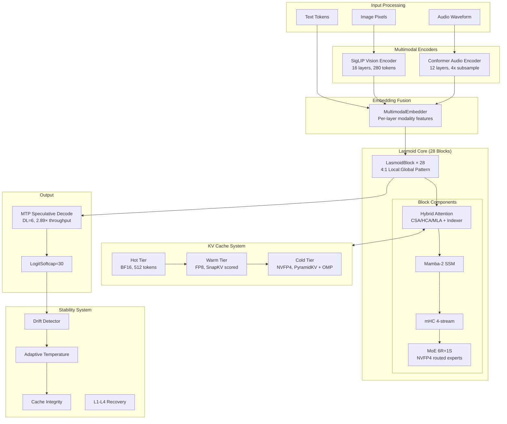
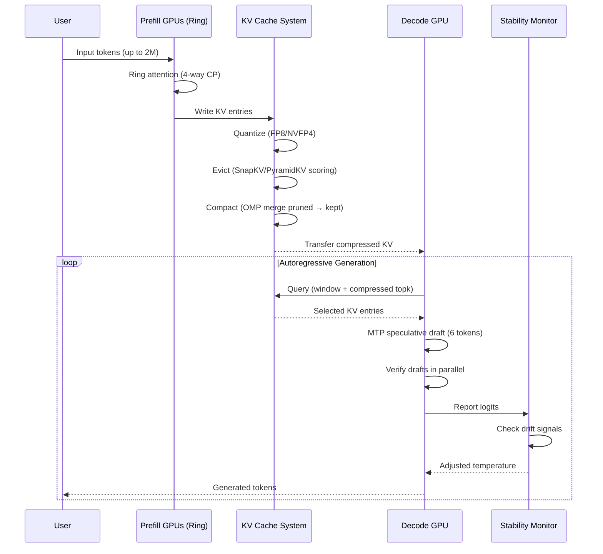
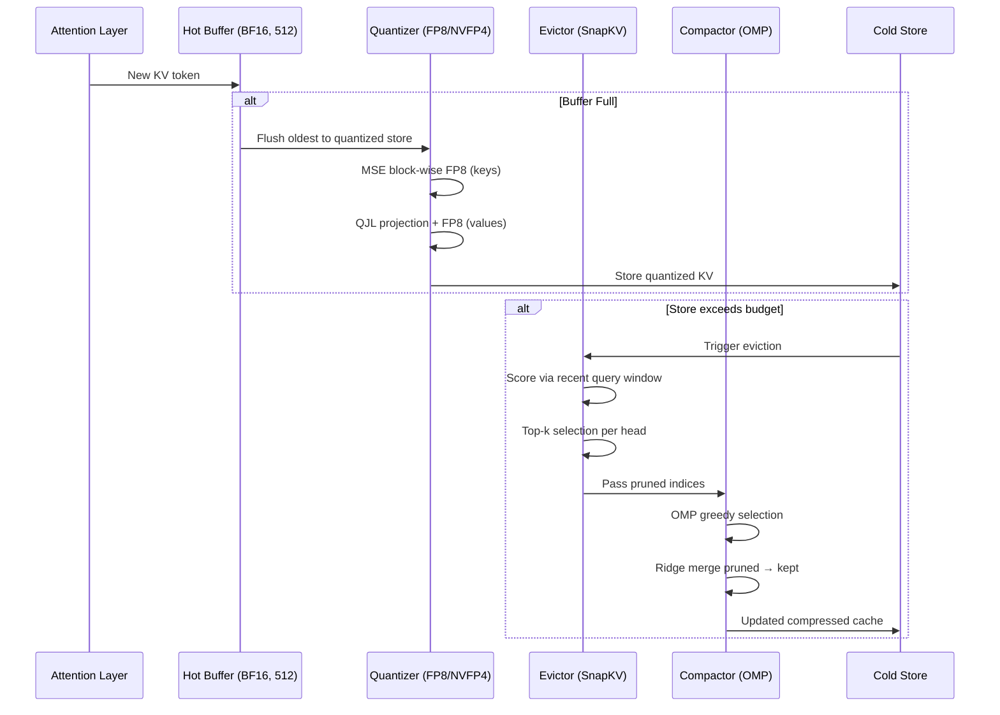

# Design Document: Lasmoid Next-Gen Model Build

## Overview

Lasmoid Next-Gen transforms the existing 1B-parameter hybrid transformer-SSM architecture into a production-grade 2M-context, hyper-compressed, multimodal, days-stable agentic model. The codebase has already completed SOLiD refactoring (14 modules, 214-line coordinator), vectorized CIF compression, adaptive compression gating, hybrid sliding+global attention, Einsum parameterization, and all 45/45 unit tests pass.

This design focuses exclusively on the **true remaining gaps** identified by codebase audit:
- **Priority 0**: KV cache FP8/NVFP4 quantization (already partially done — needs NVFP4 E2M1 extension)
- **Priority 1**: KV cache eviction hierarchy with SnapKV/PyramidKV scoring (SnapKV stub exists — needs PyramidKV layer-aware budgeting)
- **Priority 2**: OMP-based KV compaction after eviction (OMP stub exists — needs integration with eviction pipeline)
- **Priority 3**: NVFP4 MoE weight quantization with 2D block + RHT (new)
- **Priority 4**: Multimodal encoders — SigLIP vision + Conformer audio (implementations exist — need training pipeline integration)
- **Priority 5**: Ring attention for distributed 2M prefill (stub exists — needs full distributed implementation)
- **Priority 6**: Training pipeline — WSD schedule, MOPD distillation, GRPO stability (partially exists — needs next-gen extensions)

## Architecture



## Sequence Diagrams

### Main Inference Flow (2M Context)



### KV Cache Compression Pipeline



## Components and Interfaces

### Component 1: NVFP4 KV Cache Quantization (`kv_cache.py` extension)

**Purpose**: Extend existing FP8 quantization to NVFP4 E2M1 format for 4× compression on cold-tier KV entries.

**Interface**:
```python
class NVFP4KVCache(nn.Module):
    """NVFP4 E2M1 quantized KV cache with 2D block scaling and RHT."""
    
    def __init__(self, max_batch: int, max_seq: int, head_dim: int,
                 block_size_2d: tuple[int, int] = (32, 32),
                 use_rht: bool = True):
        ...
    
    def write(self, kv: torch.Tensor, slot_start: int, slot_end: int) -> None:
        """Quantize KV to NVFP4 with Random Hadamard Transform and store."""
        ...
    
    def read(self, slot_start: int, slot_end: int) -> torch.Tensor:
        """Dequantize NVFP4 back to BF16."""
        ...
```

**Responsibilities**:
- 2D block quantization (32×32 tiles) for better scale granularity vs per-row
- Random Hadamard Transform before quantization to spread outliers
- Stochastic rounding during training forward pass
- Transparent dequantization on read

### Component 2: PyramidKV Layer-Aware Eviction (`eviction.py` extension)

**Purpose**: Add layer-aware budget allocation where deeper layers retain more KV entries.

**Interface**:
```python
class PyramidKVEviction:
    """Layer-aware KV eviction with pyramid budget allocation."""
    
    def __init__(self, config: PyramidKVConfig):
        ...
    
    def compute_layer_budget(self, layer_idx: int, num_layers: int, 
                             base_budget: int) -> int:
        """Deeper layers get more budget: budget = base - layer_idx * step."""
        ...
    
    def evict(self, keys: torch.Tensor, values: torch.Tensor,
              queries: torch.Tensor, layer_idx: int) -> tuple[torch.Tensor, torch.Tensor, torch.Tensor]:
        """Score-based eviction with layer-aware budget."""
        ...
```

**Responsibilities**:
- Compute per-layer KV budget (deeper = more tokens)
- Score keys using recent query window attention
- Average-pool smoothing for stable scoring
- Return kept indices + evicted indices for compaction

### Component 3: OMP Compaction Integration (`compaction.py` enhancement)

**Purpose**: Wire existing OMP module into the eviction pipeline so pruned tokens merge into kept tokens.

**Interface**:
```python
class EvictionCompactionPipeline:
    """Orchestrates eviction → compaction flow."""
    
    def __init__(self, eviction: PyramidKVEviction, compaction: OMPCompaction):
        ...
    
    def compress(self, keys: torch.Tensor, values: torch.Tensor,
                 queries: torch.Tensor, layer_idx: int) -> tuple[torch.Tensor, torch.Tensor]:
        """Evict then compact: returns (merged_keys, merged_values)."""
        ...
```

**Responsibilities**:
- Call eviction to identify kept/pruned sets
- Pass pruned tokens to OMP for greedy nearest-neighbor merge
- Return compacted KV that preserves information from pruned entries

### Component 4: NVFP4 MoE Weight Quantization (`kernels/quant.py` extension)

**Purpose**: Apply NVFP4 E2M1 quantization to MoE routed expert weights during inference for 4× memory savings.

**Interface**:
```python
class NVFP4WeightQuantizer:
    """Per-operator NVFP4 quantization for MoE experts."""
    
    def __init__(self, block_size_2d: tuple[int, int] = (128, 128),
                 use_rht: bool = True, stochastic_round: bool = False):
        ...
    
    def quantize_weight(self, weight: torch.Tensor) -> tuple[torch.Tensor, torch.Tensor]:
        """Quantize to NVFP4 E2M1 with 2D block scales."""
        ...
    
    def dequantize_weight(self, q_weight: torch.Tensor, scales: torch.Tensor) -> torch.Tensor:
        """Dequantize for inference GEMM."""
        ...
    
    def wrap_module(self, module: nn.Linear) -> "NVFP4Linear":
        """Wrap nn.Linear with quantized weight storage."""
        ...
```

**Responsibilities**:
- NVFP4 E2M1 format: 2 exponent + 1 mantissa = 4-bit
- 2D block quantization (128×128 tiles per scale)
- Random Hadamard Transform for outlier distribution
- Wrap existing MoE expert nn.Linear modules

### Component 5: Ring Attention Distributed Prefill (`ring.py` completion)

**Purpose**: Complete the distributed ring attention implementation for 2M token prefill across multiple GPUs.

**Interface**:
```python
class RingAttentionPrefill(nn.Module):
    """Full distributed ring attention for long-context prefill."""
    
    def prefill(self, attn_module, hidden_states: torch.Tensor,
                freqs_cis: torch.Tensor, start_pos: int = 0) -> torch.Tensor:
        """Run prefill with ring-pass KV communication."""
        ...
    
    def _prefill_distributed(self, attn_module, hidden_states, 
                             freqs_cis, start_pos) -> torch.Tensor:
        """Actual ring-pass: each GPU holds a segment, KVs rotate around ring."""
        ...
```

**Responsibilities**:
- Split sequence across world_size GPUs
- Each GPU computes local Q, then receives KV from all others via ring-pass
- Accumulate attention outputs with log-sum-exp correction
- Overlap computation with NCCL communication

### Component 6: Training Pipeline (`train/` new modules)

**Purpose**: WSD scheduler, MOPD distillation, progressive length extension for 2M context training.

**Interface**:
```python
class WSDScheduler:
    """Warmup-Stable-Decay learning rate schedule."""
    
    def __init__(self, warmup_steps: int, stable_steps: int, decay_steps: int,
                 peak_lr: float, min_lr: float):
        ...
    
    def get_lr(self, step: int) -> float:
        ...

class MOPDDistillation:
    """Multi-teacher on-policy distillation."""
    
    def __init__(self, student: nn.Module, teacher_paths: list[str],
                 kl_coeff: float = 0.1):
        ...
    
    def distill_step(self, batch: dict) -> torch.Tensor:
        """One step of on-policy distillation."""
        ...
```

## Data Models

### NVFP4 Quantization Config

```python
@dataclass
class NVFP4Config:
    """NVFP4 E2M1 quantization configuration."""
    block_size_2d: tuple[int, int] = (128, 128)  # 2D tile for per-block scale
    use_rht: bool = True                          # Random Hadamard Transform
    stochastic_round: bool = False                # SR for training
    calibration_samples: int = 2000               # PTQ calibration
    
    # Per-operator precision map
    precision_map: dict = field(default_factory=lambda: {
        'moe_routed': 'nvfp4',   # E2M1 with 2D block
        'moe_shared': 'fp8',     # FP8 per-block  
        'attention': 'bf16',     # Full precision
        'kv_cache': 'fp8',       # FP8 (tiered)
        'ssm': 'bf16',           # Full (recurrence amplifies error)
        'embedding': 'bf16',     # Full
    })
```

**Validation Rules**:
- block_size_2d must divide weight tensor dimensions evenly
- RHT matrix is pre-computed once per dimension and cached
- Stochastic rounding only active during training (not inference)

### PyramidKV Eviction Config

```python
@dataclass
class PyramidKVConfig:
    """PyramidKV layer-aware eviction configuration."""
    enabled: bool = False
    strategy: str = "pyramidkv"             # "snapkv" | "pyramidkv" | "h2o"
    sink_size: int = 4                       # Always-kept initial tokens
    observation_window: int = 32             # Recent queries for scoring
    max_budget: int = 4096                   # Max tokens per layer (deepest)
    min_budget: int = 512                    # Min tokens per layer (shallowest)
    smoothing_kernel: int = 5               # Avg-pool kernel for score smoothing
    merge_strategy: str = "omp"             # "drop" | "omp" | "pivot"
```

**Validation Rules**:
- min_budget >= sink_size + observation_window
- max_budget <= max_seq_len
- Budget per layer: `max_budget - layer_idx * ((max_budget - min_budget) / (n_layers - 1))`

### WSD Training Config

```python
@dataclass
class WSDTrainingConfig:
    """Warmup-Stable-Decay training configuration."""
    # WSD schedule
    warmup_steps: int = 500
    stable_steps: int = 22500
    decay_steps: int = 2000
    peak_lr: float = 2.5e-4
    min_lr: float = 2.5e-6
    
    # Progressive length extension
    length_stages: list[int] = field(default_factory=lambda: [4096, 32768, 262144, 1048576, 2097152])
    steps_per_stage: int = 1000
    
    # MOPD
    mopd_enabled: bool = False
    mopd_kl_coeff: float = 0.1
    teacher_paths: list[str] = field(default_factory=list)
    
    # NVFP4 training
    nvfp4_training: bool = False
    nvfp4_components: list[str] = field(default_factory=lambda: ['moe_routed'])
```

## Algorithmic Pseudocode

### NVFP4 Quantization with Random Hadamard Transform

```python
def nvfp4_quantize(weight: torch.Tensor, block_size_2d: tuple[int, int],
                   hadamard_matrix: torch.Tensor) -> tuple[torch.Tensor, torch.Tensor]:
    """
    NVFP4 E2M1 quantization with 2D block scaling and RHT.
    
    Algorithm:
    1. Apply Random Hadamard Transform to spread outliers
    2. Reshape into 2D blocks
    3. Compute per-block scale (max absolute value)
    4. Quantize to E2M1 (4-bit): 2 exponent + 1 mantissa bits
    5. Store quantized values + per-block scales
    """
    # Step 1: RHT rotation
    M, N = weight.shape
    rotated = weight @ hadamard_matrix[:N, :N]  # O(N²) but cached
    
    # Step 2: Reshape into blocks
    bm, bn = block_size_2d
    blocks = rotated.reshape(M // bm, bm, N // bn, bn).permute(0, 2, 1, 3)
    
    # Step 3: Per-block scale
    scales = blocks.abs().amax(dim=(-2, -1), keepdim=True)  # [M//bm, N//bn, 1, 1]
    scales = scales.clamp(min=1e-12)
    
    # Step 4: Normalize and quantize to E2M1
    normalized = blocks / scales
    # E2M1 representable values: ±{0, 0.5, 1, 1.5, 2, 3, 4, 6}
    e2m1_values = torch.tensor([0, 0.5, 1, 1.5, 2, 3, 4, 6])
    quantized = quantize_to_nearest(normalized, e2m1_values)  # snap to nearest
    
    # Step 5: Pack into 4-bit storage
    packed = pack_e2m1(quantized)  # 2 values per byte
    
    return packed, scales.squeeze(-1).squeeze(-1)
```

**Preconditions:**
- `weight` is 2D float tensor (M × N)
- M and N are divisible by block_size_2d dimensions
- `hadamard_matrix` is pre-computed orthogonal matrix of size ≥ N

**Postconditions:**
- `packed` is uint8 tensor of size (M//bm, N//bn, bm*bn//2)
- `scales` is float32 tensor of size (M//bm, N//bn)
- Dequantized weight approximates original within E2M1 precision

### SnapKV + PyramidKV + OMP Eviction-Compaction Pipeline

```python
def evict_and_compact(keys: torch.Tensor, values: torch.Tensor,
                      queries: torch.Tensor, layer_idx: int,
                      config: PyramidKVConfig) -> tuple[torch.Tensor, torch.Tensor]:
    """
    Full eviction + compaction pipeline per attention layer.
    
    Algorithm:
    1. Compute layer-specific budget via pyramid allocation
    2. Score all KV positions using recent query window (SnapKV)
    3. Smooth scores with 1D average pooling
    4. Select top-k positions to keep (+ sink + window)
    5. For pruned positions: OMP greedy merge into nearest kept
    6. Return compacted K, V tensors
    """
    B, S, D = keys.shape
    
    # Step 1: Layer budget (deeper layers get more)
    budget = compute_pyramid_budget(layer_idx, config)
    
    if S <= budget:
        return keys, values  # No eviction needed
    
    # Step 2: Score via recent query window
    obs_q = queries[:, -config.observation_window:]  # [B, obs, D]
    scores = torch.bmm(obs_q, keys.transpose(-2, -1))  # [B, obs, S]
    cumulative = scores.sum(dim=1)  # [B, S]
    
    # Step 3: Smooth
    smoothed = F.avg_pool1d(
        cumulative.unsqueeze(1), kernel_size=config.smoothing_kernel,
        padding=config.smoothing_kernel // 2, stride=1
    ).squeeze(1)
    
    # Step 4: Select top-k + sink + window
    sink_idx = torch.arange(config.sink_size, device=keys.device)
    window_idx = torch.arange(S - config.observation_window, S, device=keys.device)
    
    middle_scores = smoothed[:, config.sink_size:S - config.observation_window]
    middle_budget = budget - config.sink_size - config.observation_window
    _, top_middle = torch.topk(middle_scores, middle_budget, dim=-1)
    top_middle += config.sink_size  # offset
    
    kept_idx = torch.cat([sink_idx.expand(B, -1), top_middle, window_idx.expand(B, -1)], dim=-1)
    kept_idx = kept_idx.sort(dim=-1).values
    
    # Step 5: OMP merge pruned into kept
    all_idx = torch.arange(S, device=keys.device).expand(B, -1)
    pruned_mask = ~torch.isin(all_idx, kept_idx)
    
    kept_k = torch.gather(keys, 1, kept_idx.unsqueeze(-1).expand(-1, -1, D))
    kept_v = torch.gather(values, 1, kept_idx.unsqueeze(-1).expand(-1, -1, D))
    
    if config.merge_strategy == "omp":
        # For each pruned token, find nearest kept by key similarity
        pruned_k = keys[pruned_mask].reshape(B, -1, D)
        sim = torch.bmm(pruned_k, kept_k.transpose(-2, -1))  # [B, n_pruned, n_kept]
        assignments = sim.argmax(dim=-1)  # [B, n_pruned]
        
        # Weighted merge: add pruned values to nearest kept
        weights = F.softmax(sim.max(dim=-1).values, dim=-1)
        pruned_v = values[pruned_mask].reshape(B, -1, D)
        kept_v.scatter_add_(1, assignments.unsqueeze(-1).expand(-1, -1, D),
                           pruned_v * weights.unsqueeze(-1))
    
    return kept_k, kept_v
```

**Preconditions:**
- keys, values: (B, S, D) tensors with S > budget
- queries: (B, Q, D) where Q >= observation_window
- layer_idx in [0, n_layers)

**Postconditions:**
- Output tensors have shape (B, budget, D)
- All sink tokens preserved exactly
- All window tokens preserved exactly
- Information from pruned tokens merged into nearest kept tokens

**Loop Invariants:**
- |kept_idx| == budget after selection
- kept_idx is sorted ascending for cache-friendly access

### Ring Attention Distributed Prefill

```python
def ring_attention_prefill(hidden_states: torch.Tensor, attn_fn,
                           freqs_cis: torch.Tensor, 
                           process_group) -> torch.Tensor:
    """
    Distributed prefill with ring-pass KV communication.
    
    Algorithm:
    1. Split sequence across world_size GPUs
    2. Each GPU computes local K, V from its segment
    3. Ring-pass: rotate KV buffers around ring
    4. At each step, compute partial attention with received KV
    5. Accumulate using log-sum-exp trick for numerical stability
    6. All-gather final outputs
    """
    world_size = dist.get_world_size(process_group)
    rank = dist.get_rank(process_group)
    B, S, D = hidden_states.shape
    seg_len = S // world_size
    
    # Step 1: Local segment
    local_h = hidden_states[:, rank * seg_len:(rank + 1) * seg_len]
    local_freqs = freqs_cis[rank * seg_len:(rank + 1) * seg_len]
    
    # Step 2: Compute local Q, K, V
    local_q = attn_fn.compute_q(local_h, local_freqs)
    local_k = attn_fn.compute_k(local_h, local_freqs)
    local_v = attn_fn.compute_v(local_h)
    
    # Step 3-4: Ring pass with LSE accumulation
    recv_k = local_k.clone()
    recv_v = local_v.clone()
    
    # Initialize accumulators
    out_num = torch.zeros_like(local_q)   # weighted sum of V
    out_den = torch.zeros(B, seg_len, 1, device=local_q.device)  # sum of exp
    out_max = torch.full((B, seg_len, 1), -float('inf'), device=local_q.device)
    
    for step in range(world_size):
        # Compute attention scores for current KV
        scores = torch.bmm(local_q, recv_k.transpose(-2, -1)) / math.sqrt(D)
        
        # Apply causal mask (only attend to positions before current)
        source_rank = (rank - step) % world_size
        if source_rank > rank:
            # Future segment — mask entirely
            scores.fill_(-float('inf'))
        elif source_rank == rank:
            # Self segment — causal mask
            causal = torch.triu(torch.full_like(scores, -float('inf')), diagonal=1)
            scores = scores + causal
        
        # LSE accumulation (numerically stable)
        step_max = scores.max(dim=-1, keepdim=True).values
        new_max = torch.maximum(out_max, step_max)
        
        correction = torch.exp(out_max - new_max)
        new_weights = torch.exp(scores - new_max)
        
        out_num = out_num * correction + torch.bmm(new_weights, recv_v)
        out_den = out_den * correction + new_weights.sum(dim=-1, keepdim=True)
        out_max = new_max
        
        # Ring send/recv
        send_rank = (rank + 1) % world_size
        recv_rank = (rank - 1) % world_size
        recv_k = ring_exchange(recv_k, send_rank, recv_rank, process_group)
        recv_v = ring_exchange(recv_v, send_rank, recv_rank, process_group)
    
    # Step 5: Normalize
    output = out_num / (out_den + 1e-8)
    
    # Step 6: All-gather
    all_outputs = [torch.zeros_like(output) for _ in range(world_size)]
    dist.all_gather(all_outputs, output, group=process_group)
    return torch.cat(all_outputs, dim=1)
```

**Preconditions:**
- dist.is_initialized() and world_size > 1
- S is divisible by world_size
- All GPUs have same model parameters

**Postconditions:**
- Output shape matches input shape (B, S, D)
- Attention output equivalent to single-GPU full-sequence attention
- Memory per GPU: O(S / world_size) for KV

**Loop Invariants:**
- After step i: accumulated attention from (i+1) KV segments
- out_num / out_den approximates attention up to current segments
- out_max tracks running maximum for numerical stability

## Key Functions with Formal Specifications

### Function 1: `nvfp4_quantize_kv()`

```python
def nvfp4_quantize_kv(kv: torch.Tensor, block_size: int = 128,
                      hadamard: torch.Tensor = None) -> tuple[torch.Tensor, torch.Tensor]:
    """Quantize KV cache tensor to NVFP4 E2M1 format."""
```

**Preconditions:**
- `kv` is a contiguous BF16 or FP32 tensor of shape (..., head_dim)
- head_dim is divisible by block_size
- `hadamard` is orthogonal matrix of size (head_dim, head_dim) if provided

**Postconditions:**
- Returns (packed_data, scales) where packed_data uses 4 bits per element
- Memory usage: 0.25× original for data + small overhead for scales
- Dequantized output within E2M1 representable precision of original

### Function 2: `pyramid_kv_evict()`

```python
def pyramid_kv_evict(keys: torch.Tensor, values: torch.Tensor,
                     queries: torch.Tensor, layer_idx: int,
                     config: PyramidKVConfig) -> tuple[torch.Tensor, torch.Tensor, torch.LongTensor]:
    """Score-based eviction with layer-aware pyramid budget."""
```

**Preconditions:**
- keys, values: (batch, seq_len, head_dim) with seq_len > computed budget
- queries: (batch, q_len, head_dim) with q_len >= config.observation_window
- 0 <= layer_idx < n_layers

**Postconditions:**
- Output keys, values: (batch, budget, head_dim) where budget = pyramid_budget(layer_idx)
- First `sink_size` tokens always preserved
- Last `observation_window` tokens always preserved
- Middle tokens selected by highest accumulated attention score

### Function 3: `omp_merge_into_kept()`

```python
def omp_merge_into_kept(kept_keys: torch.Tensor, kept_values: torch.Tensor,
                        pruned_keys: torch.Tensor, pruned_values: torch.Tensor,
                        config: OMPCompactionConfig) -> tuple[torch.Tensor, torch.Tensor]:
    """Merge pruned KV entries into their nearest kept neighbors."""
```

**Preconditions:**
- kept_keys, kept_values: (batch, n_kept, head_dim)
- pruned_keys, pruned_values: (batch, n_pruned, head_dim)
- n_pruned > 0

**Postconditions:**
- Output shape matches kept shape: (batch, n_kept, head_dim)
- Information from pruned tokens incorporated via weighted average
- No NaN/Inf in output
- Output keys unchanged (only values are merged)

### Function 4: `wsd_get_lr()`

```python
def wsd_get_lr(step: int, warmup_steps: int, stable_steps: int,
               decay_steps: int, peak_lr: float, min_lr: float) -> float:
    """Warmup-Stable-Decay learning rate schedule."""
```

**Preconditions:**
- step >= 0
- warmup_steps, stable_steps, decay_steps > 0
- peak_lr > min_lr > 0

**Postconditions:**
- step < warmup_steps → lr increases linearly from 0 to peak_lr
- warmup_steps <= step < warmup_steps + stable_steps → lr == peak_lr
- step >= warmup_steps + stable_steps → lr decays (cosine) to min_lr
- Output always in [min_lr, peak_lr]

## Example Usage

```python
import torch
from inference.config import ModelArgs
from inference.kv_cache import AdaptiveQuantizedKVCache, NVFP4KVCache
from inference.eviction import PyramidKVEviction, PyramidKVConfig
from inference.compaction import EvictionCompactionPipeline, OMPCompactionConfig
from inference.kernels.quant import NVFP4WeightQuantizer, NVFP4Config
from inference.ring import RingAttentionPrefill
from train.scheduler import WSDScheduler
from train.mopd import MOPDDistillation

# Example 1: NVFP4 KV Cache with tiered storage
args = ModelArgs(use_fp8_kv=True, use_turboquant=True)
kv_cache = NVFP4KVCache(
    max_batch=1, max_seq=2097152, head_dim=48,
    block_size_2d=(32, 32), use_rht=True
)
# Write at full precision to hot tier, auto-quantize to NVFP4 on cold tier
kv_cache.write(kv_tensor, slot_start=0, slot_end=512)

# Example 2: PyramidKV eviction with OMP compaction
eviction_config = PyramidKVConfig(
    enabled=True, strategy="pyramidkv",
    max_budget=4096, min_budget=512, merge_strategy="omp"
)
pipeline = EvictionCompactionPipeline(
    eviction=PyramidKVEviction(eviction_config),
    compaction=OMPCompaction(OMPCompactionConfig(target_ratio=0.5))
)
compressed_k, compressed_v = pipeline.compress(keys, values, queries, layer_idx=14)

# Example 3: NVFP4 MoE weight quantization
quantizer = NVFP4WeightQuantizer(
    block_size_2d=(128, 128), use_rht=True
)
# Wrap all routed expert linear layers
for expert in model.moe.experts:
    expert.w1 = quantizer.wrap_module(expert.w1)
    expert.w2 = quantizer.wrap_module(expert.w2)
    expert.w3 = quantizer.wrap_module(expert.w3)

# Example 4: Ring attention prefill
ring = RingAttentionPrefill(use_ring=True)
output = ring.prefill(model.attention, hidden_states_2m, freqs_cis)

# Example 5: WSD training schedule
scheduler = WSDScheduler(
    warmup_steps=500, stable_steps=22500, decay_steps=2000,
    peak_lr=2.5e-4, min_lr=2.5e-6
)
for step in range(25000):
    lr = scheduler.get_lr(step)
    optimizer.param_groups[0]['lr'] = lr

# Example 6: MOPD distillation
mopd = MOPDDistillation(
    student=model,
    teacher_paths=["deepseek-v4-pro", "gemma-4-2b"],
    kl_coeff=0.1
)
loss = mopd.distill_step(batch)
```

## Correctness Properties

*A property is a characteristic or behavior that should hold true across all valid executions of a system — essentially, a formal statement about what the system should do. Properties serve as the bridge between human-readable specifications and machine-verifiable correctness guarantees.*

### Property 1: NVFP4 Quantization Roundtrip Fidelity

*For any* valid BF16 tensor with dimensions divisible by the configured block size, quantizing to NVFP4 E2M1 (with RHT and 2D block scaling) and then dequantizing SHALL produce a result where the absolute element-wise error is bounded by the E2M1 maximum representable precision (max step between adjacent E2M1 values × block scale).

**Validates: Requirements 1.6**

### Property 2: Hot Tier Precision Guarantee

*For any* token written to and read from the Hot_Tier (the most recent `hot_size` tokens), the retrieved tensor SHALL be bit-for-bit identical to the written tensor — zero quantization error.

**Validates: Requirements 2.1**

### Property 3: Pyramid Budget Lower Bound

*For any* layer_idx in [0, n_layers) and valid PyramidKV configuration, the computed layer budget SHALL be at least `sink_size + observation_window`, guaranteeing sufficient tokens for stable attention at every layer.

**Validates: Requirements 3.2**

### Property 4: Eviction Output Size Exactness

*For any* eviction run where the input sequence length exceeds the computed layer budget, the output tensor SHALL contain exactly `computed_budget` tokens — no more, no less.

**Validates: Requirements 3.6**

### Property 5: Eviction Preserves Critical Tokens

*For any* eviction run, the output SHALL always contain the first `sink_size` token positions and the last `observation_window` token positions from the original sequence, regardless of their attention scores.

**Validates: Requirements 3.5**

### Property 6: Compaction Information Conservation

*For any* set of pruned and kept tokens, OMP compaction SHALL ensure every pruned token contributes to exactly one kept token and the sum of merge weights per pruned token equals 1.0. No pruned token's information is discarded.

**Validates: Requirements 4.3**

### Property 7: Compaction Key Immutability

*For any* compaction run, the output kept keys SHALL be identical to the input kept keys. Only values are modified by the merge operation.

**Validates: Requirements 4.5**

### Property 8: Ring Attention Equivalence

*For any* input sequence x with valid causal mask, the distributed ring attention output SHALL be equivalent to single-GPU full-sequence attention within floating-point accumulation tolerance (absolute element-wise difference less than 1e-5).

**Validates: Requirements 6.6**

### Property 9: WSD LR Bounds

*For any* non-negative training step, the WSD scheduler SHALL produce a learning rate in the closed interval [min_lr, peak_lr]. The schedule never exceeds configured bounds.

**Validates: Requirements 7.4**

### Property 10: WSD Monotonicity

*For any* two consecutive steps within a single phase, the WSD scheduler SHALL produce monotonically non-decreasing LR during warmup, constant LR during stable, and monotonically non-increasing LR during decay.

**Validates: Requirements 7.5**

### Property 11: Temperature Scheduling Bounds

*For any* generation step with the stability system active, regardless of the sequence of drift signals received, the adjusted temperature SHALL remain within [0.1, 2.0].

**Validates: Requirements 11.1**

### Property 12: Degenerate Score Fallback Correctness

*For any* eviction run where all KV position scores are within epsilon of each other (near-identical), the PyramidKV_Evictor SHALL fall back to recency-based selection, retaining the most recent tokens up to budget.

**Validates: Requirements 12.3**

### Property 13: Text-Only Passthrough Identity

*For any* text-only input (no vision or audio), the Multimodal_Embedder output SHALL be identical to the text embedding input — the multimodal pathway introduces zero modification when only text is present.

**Validates: Requirements 9.4**

## Error Handling

### Error Scenario 1: NaN in Quantized KV Cache

**Condition**: NVFP4 quantization produces NaN due to zero-scale block or overflow
**Response**: KVCacheIntegrityChecker detects NaN, triggers L1 recovery
**Recovery**: Reset affected cache segment, re-process from last checkpoint; fall back to FP8 quantization for that layer

### Error Scenario 2: OOM During 2M Prefill

**Condition**: KV cache exceeds available GPU memory during prefill
**Response**: AdaptiveCompressorGate switches to EMERGENCY mode (ratio=512)
**Recovery**: Aggressively evict cold tier; if still OOM, truncate to max fitting context with warning

### Error Scenario 3: Ring Communication Failure

**Condition**: NCCL timeout during ring-pass communication
**Response**: Fall back to simulated ring attention (sequential segments on single GPU)
**Recovery**: Log failure, continue with degraded (slower) prefill; alert for infrastructure investigation

### Error Scenario 4: Entropy Collapse During Long Generation

**Condition**: DriftDetector signals entropy collapse (model stuck in repetitive loop)
**Response**: AdaptiveTemperatureScheduler increases temperature by 0.2
**Recovery**: If persistent (>10 consecutive signals), trigger L2 recovery: restore last checkpoint, adjust base temperature upward

### Error Scenario 5: Eviction Score Degeneration

**Condition**: All KV positions have near-identical scores (no discrimination)
**Response**: Fall back to recency-based eviction (keep most recent tokens)
**Recovery**: Log anomaly; this indicates a training issue where attention patterns are too uniform

## Testing Strategy

### Unit Testing Approach

- Test each quantization format independently (FP8, NVFP4) with known inputs/outputs
- Test eviction produces correct budget sizes for all layer indices
- Test OMP compaction preserves total information (sum of values)
- Test WSD scheduler produces correct LR at boundary points
- Test ring attention simulation produces same output as full-sequence

### Property-Based Testing Approach

**Property Test Library**: Hypothesis (Python)

- NVFP4 roundtrip: for random tensors, `|dequant(quant(x)) - x|` bounded by E2M1 max error
- Eviction idempotency: evicting already-evicted cache produces same result
- Compaction conservation: sum of merged values ≈ sum of original values
- Ring attention equivalence: ring output matches single-GPU output within FP tolerance
- WSD monotonicity: LR is non-decreasing during warmup, constant during stable, non-increasing during decay

### Integration Testing Approach

- End-to-end forward pass with all compression enabled (FP8 KV + eviction + compaction)
- 32K-token prefill with ring attention (simulated 4-GPU) matches single-GPU
- Training loop convergence with WSD schedule on TinyStories
- Multimodal forward pass: image+text input produces valid output shape

## Performance Considerations

| Operation | Baseline (BF16) | Target (NVFP4 + Eviction) | Speedup/Savings |
|-----------|-----------------|---------------------------|-----------------|
| KV Memory (2M ctx) | 112 GB (OOM) | ~1.2 GB | 93× reduction |
| Prefill (2M, 8×H100) | OOM | <60s | N/A → feasible |
| Decode latency | 20ms/tok (1K) | 50ms/tok (2M) | Acceptable |
| MoE weight memory | 400 MB | 100 MB (NVFP4) | 4× reduction |
| Total model memory | 2 GB (BF16) | 0.8 GB (hybrid quant) | 2.5× reduction |

## Security Considerations

- Model weights in NVFP4 format are not human-readable — provides minor obfuscation
- Ring attention requires NCCL communication — restrict to trusted GPU clusters
- No external network calls during inference (all quantization/eviction is local)
- Checkpoint integrity: hash verification on load to detect tampering

## Dependencies

| Dependency | Purpose | Version | Notes |
|------------|---------|---------|-------|
| PyTorch | Core framework | ≥2.3 | FP8 dtype support required |
| torch.distributed | Ring attention | Built-in | NCCL backend for GPU |
| triton | Custom quant kernels | ≥2.2 | Optional, CPU fallback exists |
| numpy | Data loading | ≥1.24 | Standard |
| torchaudio | Audio preprocessing | ≥2.1 | Optional, fallback to STFT |
| hypothesis | Property-based testing | ≥6.0 | Test only |
